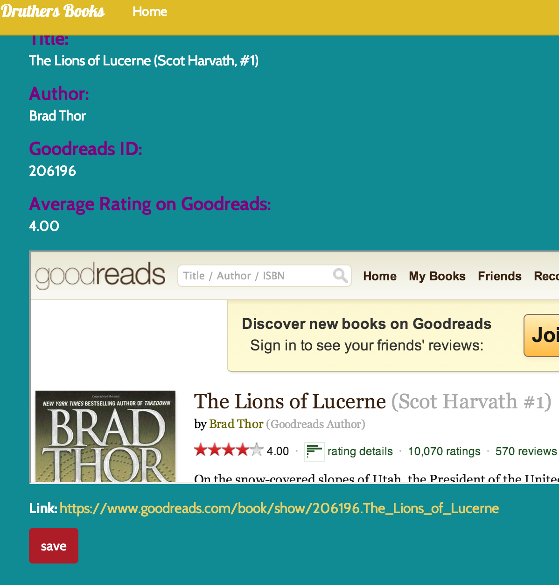
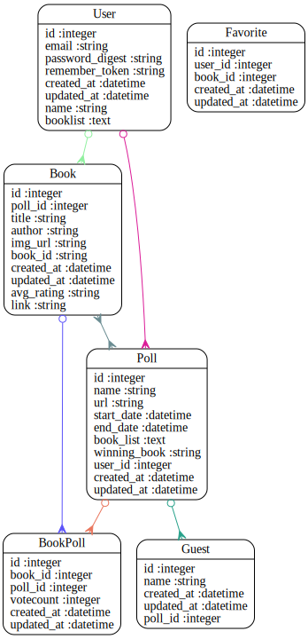

minCode Review for taylor_c
================================================
Project: druthers_app
================================================
#URLS

* HEROKU: https://druthersbooks.herokuapp.com/
* GITHUB: https://github.com/taylorchiu/druthers_app

# Summary



#Review Rubric

##Implementation Expecations

* Models & Data Relationships
	* Expectation: At least 2 related models
	* Review: ++Good selection of models
* Handles Invalid Data
	*  Expectation: Rails model validation for presence of necessary fields
	* Review:Poll and User have validations
* Views & Templates	
	*  Expectation: Form partial used, but other duplication still exists
	* Review:+Partials used to reduce duplication
* Authentication
	*  Expectation: Appropriate helper methods defined
	* Review:++SessionHelper defined and used
* Authorization
	* Expectation: Authorization scheme is well-thought out and used correctly.
	* Review:++Authorization correctly implemented 
* API
	*  Expectation: An API call was made.
	* Review:Good Reads API Used
* Testing
	*  Expectation: Includes request specs.
	* Review:--Some tests paritially implemented
* Heroku
	*  Expectation: Project is hosted on Heroku
	* Review:Yes https://druthersbooks.herokuapp.com/
* JavaScript/jQuery
	* Expectation: JS/jQuery is used to handle at least one interactive event after the window loads
	* Review:--No javascript seen in first review

##Code Quality Expectations

* Test Driven
	* Expectation: In addition to models, requests have been tested for valid 	responses and valid data
	* Review:Some test
* Flexible / extensible / scalable
	* Expectation: No database calls inside a loop
	* Review:Looks Good
* Well-commented
	* Expectation: Comments are not sporadic. Comments address the "why".
	* Review:++Some good comments explaining intent
* Well-formatted, Clean Project
	* Expectation: No mix of tabs and spaces
	* Review:A bit of a mix
* Follows naming conventions
	* Expectation: Naming follows best practices (semantic variable naming)
	* Review:Yes
* Secure
	* Expectation: Authorization is implemented as well as authentication.  Athorization is achieved through controller methods or helpers that limit resources
	* Review:--Authorization implemented through scoping, Book Update appears unprotected?
* Documenting Work
	* Expectation: Public presentation of work involving key aspects of development process
	* Review:--Default Readme used
	


#Your Gemfile

```
source 'https://rubygems.org'

# Bundle edge Rails instead: gem 'rails', github: 'rails/rails'
gem 'rails', '4.0.4'

# Use SCSS for stylesheets
gem 'sass-rails', '~> 4.0.2'

# Use Uglifier as compressor for JavaScript assets
gem 'uglifier', '>= 1.3.0'

# Use CoffeeScript for .js.coffee assets and views
gem 'coffee-rails', '~> 4.0.0'

# See https://github.com/sstephenson/execjs#readme for more supported runtimes
# gem 'therubyracer', platforms: :ruby

# Use jquery as the JavaScript library
gem 'jquery-rails'

# Turbolinks makes following links in your web application faster. Read more: https://github.com/rails/turbolinks
gem 'turbolinks'

# Build JSON APIs with ease. Read more: https://github.com/rails/jbuilder
gem 'jbuilder', '~> 1.2'

gem 'pg'
#Use Postgres for your database

gem 'better_errors'
gem 'bcrypt-ruby','3.1.2'
gem 'typhoeus'

group :doc do
  # bundle exec rake doc:rails generates the API under doc/api.
  gem 'sdoc', require: false
end

group :development, :test do
	gem 'dotenv-rails'
	gem 'pry'
	gem 'rspec-rails'
	gem 'factory_girl_rails'
end

group :production do
	gem 'rails_12factor'
end


# Use ActiveModel has_secure_password
# gem 'bcrypt', '~> 3.1.7'

# Use unicorn as the app server
# gem 'unicorn'

# Use Capistrano for deployment
# gem 'capistrano', group: :development

# Use debugger
# gem 'debugger', group: [:development, :test]

```


#Your Schema

```
# encoding: UTF-8
# This file is auto-generated from the current state of the database. Instead
# of editing this file, please use the migrations feature of Active Record to
# incrementally modify your database, and then regenerate this schema definition.
#
# Note that this schema.rb definition is the authoritative source for your
# database schema. If you need to create the application database on another
# system, you should be using db:schema:load, not running all the migrations
# from scratch. The latter is a flawed and unsustainable approach (the more migrations
# you'll amass, the slower it'll run and the greater likelihood for issues).
#
# It's strongly recommended that you check this file into your version control system.

ActiveRecord::Schema.define(version: 20140508223832) do

  # These are extensions that must be enabled in order to support this database
  enable_extension "plpgsql"

  create_table "book_polls", force: true do |t|
    t.integer  "book_id"
    t.integer  "poll_id"
    t.integer  "votecount"
    t.datetime "created_at"
    t.datetime "updated_at"
  end

  create_table "books", force: true do |t|
    t.integer  "poll_id"
    t.string   "title"
    t.string   "author"
    t.string   "img_url"
    t.string   "book_id"
    t.datetime "created_at"
    t.datetime "updated_at"
    t.string   "avg_rating"
    t.string   "link"
  end

  add_index "books", ["poll_id"], name: "index_books_on_poll_id", using: :btree

  create_table "favorites", force: true do |t|
    t.integer  "user_id"
    t.integer  "book_id"
    t.datetime "created_at"
    t.datetime "updated_at"
  end

  create_table "guests", force: true do |t|
    t.string   "name"
    t.datetime "created_at"
    t.datetime "updated_at"
    t.integer  "poll_id"
  end

  create_table "polls", force: true do |t|
    t.string   "name"
    t.string   "url"
    t.datetime "start_date"
    t.datetime "end_date"
    t.text     "book_list"
    t.string   "winning_book"
    t.integer  "user_id"
    t.datetime "created_at"
    t.datetime "updated_at"
  end

  add_index "polls", ["user_id"], name: "index_polls_on_user_id", using: :btree

  create_table "users", force: true do |t|
    t.string   "email"
    t.string   "password_digest"
    t.string   "remember_token"
    t.datetime "created_at"
    t.datetime "updated_at"
    t.string   "name"
    t.text     "booklist"
  end

end

```


#Your Schema Diagram





#Your Rspec Results

```

Guest
  add some examples to (or delete) /work/ga/wdi/2014/march/project1/taylor_c/spec/models/guest_spec.rb (PENDING: No reason given)

Poll
  add some examples to (or delete) /work/ga/wdi/2014/march/project1/taylor_c/spec/models/poll_spec.rb (PENDING: No reason given)

User
  email
    should be unique (FAILED - 1)
    should have the proper format
    should have a valid email address

Book
  add some examples to (or delete) /work/ga/wdi/2014/march/project1/taylor_c/spec/models/book_spec.rb (PENDING: No reason given)

BooksController
  GET index
    renders the index template (FAILED - 2)
    returns a 200 Ok status (FAILED - 3)

Favorite
  add some examples to (or delete) /work/ga/wdi/2014/march/project1/taylor_c/spec/models/favorite_spec.rb (PENDING: No reason given)

BookPoll
  add some examples to (or delete) /work/ga/wdi/2014/march/project1/taylor_c/spec/models/book_poll_spec.rb (PENDING: No reason given)

Pending:
  Guest add some examples to (or delete) /work/ga/wdi/2014/march/project1/taylor_c/spec/models/guest_spec.rb
    # No reason given
    # ./spec/models/guest_spec.rb:4
  Poll add some examples to (or delete) /work/ga/wdi/2014/march/project1/taylor_c/spec/models/poll_spec.rb
    # No reason given
    # ./spec/models/poll_spec.rb:4
  Book add some examples to (or delete) /work/ga/wdi/2014/march/project1/taylor_c/spec/models/book_spec.rb
    # No reason given
    # ./spec/models/book_spec.rb:4
  Favorite add some examples to (or delete) /work/ga/wdi/2014/march/project1/taylor_c/spec/models/favorite_spec.rb
    # No reason given
    # ./spec/models/favorite_spec.rb:4
  BookPoll add some examples to (or delete) /work/ga/wdi/2014/march/project1/taylor_c/spec/models/book_poll_spec.rb
    # No reason given
    # ./spec/models/book_poll_spec.rb:4

Failures:

  1) User email should be unique
     Failure/Error: user2 = FactoryGirl.create(:user, email: user2.email)
     NoMethodError:
       undefined method `email' for nil:NilClass
     # ./spec/models/user_spec.rb:17:in `block (3 levels) in <top (required)>'

  2) BooksController GET index renders the index template
     Failure/Error: get :index
     NoMethodError:
       undefined method `id' for nil:NilClass
     # ./app/controllers/books_controller.rb:80:in `index'
     # ./spec/controllers/books_controller_spec.rb:12:in `block (3 levels) in <top (required)>'

  3) BooksController GET index returns a 200 Ok status
     Failure/Error: get :index
     NoMethodError:
       undefined method `id' for nil:NilClass
     # ./app/controllers/books_controller.rb:80:in `index'
     # ./spec/controllers/books_controller_spec.rb:7:in `block (3 levels) in <top (required)>'

Finished in 0.10158 seconds
10 examples, 3 failures, 5 pending

Failed examples:

rspec ./spec/models/user_spec.rb:15 # User email should be unique
rspec ./spec/controllers/books_controller_spec.rb:11 # BooksController GET index renders the index template
rspec ./spec/controllers/books_controller_spec.rb:5 # BooksController GET index returns a 200 Ok status

Randomized with seed 21989


```


#Automated Best Practices Review Results

```


Source Codes: |====================================================================|
/work/ga/wdi/2014/march/project1/taylor_c/db/schema.rb:19 - always add db index (book_polls => [book_id])
/work/ga/wdi/2014/march/project1/taylor_c/db/schema.rb:19 - always add db index (book_polls => [poll_id])
/work/ga/wdi/2014/march/project1/taylor_c/db/schema.rb:27 - always add db index (books => [book_id])
/work/ga/wdi/2014/march/project1/taylor_c/db/schema.rb:41 - always add db index (favorites => [user_id])
/work/ga/wdi/2014/march/project1/taylor_c/db/schema.rb:41 - always add db index (favorites => [book_id])
/work/ga/wdi/2014/march/project1/taylor_c/db/schema.rb:48 - always add db index (guests => [poll_id])
/work/ga/wdi/2014/march/project1/taylor_c/app/controllers/books_controller.rb:80 - move finder to named_scope
/work/ga/wdi/2014/march/project1/taylor_c/app/controllers/polls_controller.rb:15 - move model logic into model (@poll use_count > 4)
/work/ga/wdi/2014/march/project1/taylor_c/app/helpers/sessions_helper.rb:7 - remove unused methods (SessionsHelper#sign_in)
/work/ga/wdi/2014/march/project1/taylor_c/app/helpers/sessions_helper.rb:22 - remove unused methods (SessionsHelper#signed_in_user)
/work/ga/wdi/2014/march/project1/taylor_c/app/helpers/sessions_helper.rb:33 - remove unused methods (SessionsHelper#sign_out)
/work/ga/wdi/2014/march/project1/taylor_c/app/helpers/sessions_helper.rb:39 - remove unused methods (SessionsHelper#current_user=)
/work/ga/wdi/2014/march/project1/taylor_c/app/views/books/_table.html.erb:11 - replace instance variable with local variable
/work/ga/wdi/2014/march/project1/taylor_c/app/views/polls/_form.html.erb:1 - replace instance variable with local variable
/work/ga/wdi/2014/march/project1/taylor_c/app/views/polls/_table.html.erb:12 - replace instance variable with local variable
/work/ga/wdi/2014/march/project1/taylor_c/app/views/polls/_table.html.erb:19 - replace instance variable with local variable
/work/ga/wdi/2014/march/project1/taylor_c/config/routes.rb:21 - restrict auto-generated routes users (only: [:new, :create, :update])
/work/ga/wdi/2014/march/project1/taylor_c/app/views/polls/edit.html.erb:2 - simplify render in views
/work/ga/wdi/2014/march/project1/taylor_c/app/controllers/books_controller.rb:62 - use model association (for @favorite)
/work/ga/wdi/2014/march/project1/taylor_c/app/controllers/polls_controller.rb:15 - use model association (for @poll)
/work/ga/wdi/2014/march/project1/taylor_c/app/controllers/books_controller.rb:7 - remove trailing whitespace
/work/ga/wdi/2014/march/project1/taylor_c/config/routes.rb:9 - remove trailing whitespace
/work/ga/wdi/2014/march/project1/taylor_c/app/views/books/_table.html.erb:16 - remove trailing whitespace
/work/ga/wdi/2014/march/project1/taylor_c/app/views/sessions/new.html.erb:3 - remove trailing whitespace
/work/ga/wdi/2014/march/project1/taylor_c/app/views/shared/_header.html.erb:8 - remove trailing whitespace
/work/ga/wdi/2014/march/project1/taylor_c/app/views/users/edit.html.erb:14 - remove trailing whitespace
/work/ga/wdi/2014/march/project1/taylor_c/app/views/users/new.html.erb:14 - remove trailing whitespace

Please go to http://rails-bestpractices.com to see more useful Rails Best Practices.

Found 27 warnings.

```


#Automated Code Review Results

```
Inspecting 37 files
CWCCCCWCWCC.CCC...CW....CC.CC.....W.C

Offenses:

app/controllers/application_controller.rb:1:1: C: Missing top-level class documentation comment.
class ApplicationController < ActionController::Base
^^^^^
app/controllers/books_controller.rb:1:1: C: Missing top-level class documentation comment.
class BooksController < ApplicationController
^^^^^
app/controllers/books_controller.rb:2:1: C: Use 2 (not 1) spaces for indentation.
	def search
^
app/controllers/books_controller.rb:2:1: C: Tab detected.
	def search
^
app/controllers/books_controller.rb:3:1: C: Tab detected.
	end
^
app/controllers/books_controller.rb:5:1: C: Tab detected.
	def results
^
app/controllers/books_controller.rb:5:2: C: Method has too many lines. [19/10]
	def results
 ^^^
app/controllers/books_controller.rb:6:1: C: Tab detected.
		# user searches by title, which gets sent to the API via Typhoeus.get and saved in an array, @goodreads_data
^
app/controllers/books_controller.rb:6:80: C: Line is too long. [110/79]
		# user searches by title, which gets sent to the API via Typhoeus.get and saved in an array, @goodreads_data
                                                                               ^^^^^^^^^^^^^^^^^^^^^^^^^^^^^^^
app/controllers/books_controller.rb:7:3: C: Tab detected.
  	# the while loop iterates through the giant API response and saves just the title, author, and book_id to the @goodreads_data 
  ^
app/controllers/books_controller.rb:7:80: C: Line is too long. [129/79]
  	# the while loop iterates through the giant API response and saves just the title, author, and book_id to the @goodreads_data 
                                                                               ^^^^^^^^^^^^^^^^^^^^^^^^^^^^^^^^^^^^^^^^^^^^^^^^^^
app/controllers/books_controller.rb:7:129: C: Trailing whitespace detected.
  	# the while loop iterates through the giant API response and saves just the title, author, and book_id to the @goodreads_data 
                                                                                                                                ^
app/controllers/books_controller.rb:8:3: C: Tab detected.
  	#instance variable, which we call in the results.html.erb view to display the search results.
  ^
app/controllers/books_controller.rb:8:4: C: Missing space after #.
  	#instance variable, which we call in the results.html.erb view to display the search results.
   ^^^^^^^^^^^^^^^^^^^^^^^^^^^^^^^^^^^^^^^^^^^^^^^^^^^^^^^^^^^^^^^^^^^^^^^^^^^^^^^^^^^^^^^^^^^^^
app/controllers/books_controller.rb:8:80: C: Line is too long. [96/79]
  	#instance variable, which we call in the results.html.erb view to display the search results.
                                                                               ^^^^^^^^^^^^^^^^^
app/controllers/books_controller.rb:9:1: C: Tab detected.
		if params[:title] == nil
^
app/controllers/books_controller.rb:9:2: C: Use 2 (not 1) spaces for indentation.
		if params[:title] == nil
 ^
app/controllers/books_controller.rb:9:21: C: Prefer the use of the nil? predicate.
		if params[:title] == nil
                    ^^
app/controllers/books_controller.rb:10:1: C: Tab detected.
			@search = params[:author]
^
app/controllers/books_controller.rb:10:3: C: Use 2 (not 1) spaces for indentation.
			@search = params[:author]
  ^
app/controllers/books_controller.rb:11:1: C: Tab detected.
		else
^
app/controllers/books_controller.rb:12:1: C: Tab detected.
			@search = params[:title]
^
app/controllers/books_controller.rb:12:3: C: Use 2 (not 1) spaces for indentation.
			@search = params[:title]
  ^
app/controllers/books_controller.rb:13:1: C: Tab detected.
		end
^
app/controllers/books_controller.rb:14:1: C: Tab detected.
		@search = @search.gsub(" ", "%20")
^
app/controllers/books_controller.rb:14:26: C: Prefer single-quoted strings when you don't need string interpolation or special symbols.
		@search = @search.gsub(" ", "%20")
                         ^^^
app/controllers/books_controller.rb:14:31: C: Prefer single-quoted strings when you don't need string interpolation or special symbols.
		@search = @search.gsub(" ", "%20")
                              ^^^^^
app/controllers/books_controller.rb:15:1: C: Tab detected.
		results = Typhoeus.get("https://www.goodreads.com/search.xml?key=#{ENV['GOODREADS_KEY']}&q=#{@search}")
^
app/controllers/books_controller.rb:15:80: C: Line is too long. [105/79]
		results = Typhoeus.get("https://www.goodreads.com/search.xml?key=#{ENV['GOODREADS_KEY']}&q=#{@search}")
                                                                               ^^^^^^^^^^^^^^^^^^^^^^^^^^
app/controllers/books_controller.rb:16:1: C: Tab detected.
		data = Hash.from_xml(results.response_body)
^
app/controllers/books_controller.rb:17:3: C: Tab detected.
  	if data['GoodreadsResponse']['search']['results_end'].to_i == 0
  ^
app/controllers/books_controller.rb:17:4: C: Inconsistent indentation detected.
  	if data['GoodreadsResponse']['search']['results_end'].to_i == 0
   ^^^^^^^^^^^^^^^^^^^^^^^^^^^^^^^^^^^^^^^^^^^^^^^^^^^^^^^^^^^^^^^
app/controllers/books_controller.rb:18:3: C: Tab detected.
  		return redirect_to(error_path)
  ^
app/controllers/books_controller.rb:18:4: C: Use 2 (not 1) spaces for indentation.
  		return redirect_to(error_path)
   ^
app/controllers/books_controller.rb:19:3: C: Tab detected.
  	else
  ^
app/controllers/books_controller.rb:20:1: C: Tab detected.
			@goodreads_data = []
^
app/controllers/books_controller.rb:20:4: C: Use 2 (not 0) spaces for indentation.
			@goodreads_data = []
   
app/controllers/books_controller.rb:21:1: C: Tab detected.
			i = 0
^
app/controllers/books_controller.rb:22:1: C: Tab detected.
			while i <= 10 do
^
app/controllers/books_controller.rb:22:18: C: Never use do with multi-line while.
			while i <= 10 do
                 ^^
app/controllers/books_controller.rb:23:1: C: Tab detected.
				book = data['GoodreadsResponse']['search']['results']['work'][i]
^
app/controllers/books_controller.rb:23:4: C: Use 2 (not 1) spaces for indentation.
				book = data['GoodreadsResponse']['search']['results']['work'][i]
   ^
app/controllers/books_controller.rb:24:1: C: Tab detected.
				@goodreads_data << {title: book['best_book']['title'], author: book['best_book']['author']['name'], book_id: book['best_book']['id'] }
^
app/controllers/books_controller.rb:24:24: C: Space inside { missing.
				@goodreads_data << {title: book['best_book']['title'], author: book['best_book']['author']['name'], book_id: book['best_book']['id'] }
                       ^
app/controllers/books_controller.rb:24:80: C: Line is too long. [138/79]
				@goodreads_data << {title: book['best_book']['title'], author: book['best_book']['author']['name'], book_id: book['best_book']['id'] }
                                                                               ^^^^^^^^^^^^^^^^^^^^^^^^^^^^^^^^^^^^^^^^^^^^^^^^^^^^^^^^^^^
app/controllers/books_controller.rb:25:1: C: Tab detected.
				i += 1
^
app/controllers/books_controller.rb:26:1: C: Tab detected.
			end
^
app/controllers/books_controller.rb:27:1: C: Tab detected.
		end
^
app/controllers/books_controller.rb:27:3: W: end at 27, 2 is not aligned with if at 17, 3
		end
  ^^^
app/controllers/books_controller.rb:28:1: C: Tab detected.
	end
^
app/controllers/books_controller.rb:30:1: C: Tab detected.
	def details
^
app/controllers/books_controller.rb:30:2: C: Method has too many lines. [20/10]
	def details
 ^^^
app/controllers/books_controller.rb:31:1: C: Tab detected.
	 	@book_id = params[:id]
^
app/controllers/books_controller.rb:32:3: C: Tab detected.
  	results = Typhoeus.get("https://www.goodreads.com/book/show/#{@book_id}?format=xml&key=#{ENV['GOODREADS_KEY']}")
  ^
app/controllers/books_controller.rb:32:80: C: Line is too long. [115/79]
  	results = Typhoeus.get("https://www.goodreads.com/book/show/#{@book_id}?format=xml&key=#{ENV['GOODREADS_KEY']}")
                                                                               ^^^^^^^^^^^^^^^^^^^^^^^^^^^^^^^^^^^^
app/controllers/books_controller.rb:33:3: C: Tab detected.
  	data = Hash.from_xml(results.response_body)
  ^
app/controllers/books_controller.rb:34:3: C: Tab detected.
  	@data_main = data['GoodreadsResponse']['book']
  ^
app/controllers/books_controller.rb:35:3: C: Tab detected.
  	@title = @data_main['title']
  ^
app/controllers/books_controller.rb:36:3: C: Tab detected.
  	if @data_main['authors']['author'].is_a?(Hash) == true
  ^
app/controllers/books_controller.rb:37:3: C: Tab detected.
  			@author = @data_main['authors']['author']['name']
  ^
app/controllers/books_controller.rb:38:3: C: Tab detected.
  		else
  ^
app/controllers/books_controller.rb:39:3: C: Tab detected.
  			@author = @data_main['authors']['author'][0]['name']
  ^
app/controllers/books_controller.rb:39:5: C: Use 2 (not 1) spaces for indentation.
  			@author = @data_main['authors']['author'][0]['name']
    ^
app/controllers/books_controller.rb:40:3: C: Tab detected.
  		end
  ^
app/controllers/books_controller.rb:40:5: W: end at 40, 4 is not aligned with if at 36, 3
  		end
    ^^^
app/controllers/books_controller.rb:41:3: C: Tab detected.
  	@img_url = @data_main['image_url']
  ^
app/controllers/books_controller.rb:42:3: C: Tab detected.
  		if @img_url.include? "nocover"
  ^
app/controllers/books_controller.rb:42:5: C: Inconsistent indentation detected.
  		if @img_url.include? "nocover"
    ^^^^^^^^^^^^^^^^^^^^^^^^^^^^^^
app/controllers/books_controller.rb:42:26: C: Prefer single-quoted strings when you don't need string interpolation or special symbols.
  		if @img_url.include? "nocover"
                         ^^^^^^^^^
app/controllers/books_controller.rb:43:3: C: Tab detected.
  			@img_url = 'http://s3.amazonaws.com/thumbnails.illustrationsource.com/huge.6.33646.JPG'
  ^
app/controllers/books_controller.rb:43:5: C: Use 2 (not 1) spaces for indentation.
  			@img_url = 'http://s3.amazonaws.com/thumbnails.illustrationsource.com/huge.6.33646.JPG'
    ^
app/controllers/books_controller.rb:43:80: C: Line is too long. [92/79]
  			@img_url = 'http://s3.amazonaws.com/thumbnails.illustrationsource.com/huge.6.33646.JPG'
                                                                               ^^^^^^^^^^^^^
app/controllers/books_controller.rb:44:3: C: Tab detected.
  		else
  ^
app/controllers/books_controller.rb:45:3: C: Tab detected.
  			@img_url = @img_url
  ^
app/controllers/books_controller.rb:45:5: C: Use 2 (not 1) spaces for indentation.
  			@img_url = @img_url
    ^
app/controllers/books_controller.rb:46:3: C: Tab detected.
  		end
  ^
app/controllers/books_controller.rb:47:3: C: Tab detected.
  	@book_id = @data_main['id']
  ^
app/controllers/books_controller.rb:48:3: C: Tab detected.
  	@avg_rating = @data_main['average_rating']
  ^
app/controllers/books_controller.rb:49:3: C: Tab detected.
  	@link = @data_main['link']
  ^
app/controllers/books_controller.rb:50:3: C: Tab detected.
  	@book = Book.new
  ^
app/controllers/books_controller.rb:51:3: W: end at 51, 2 is not aligned with def at 30, 1
  end
  ^^^
app/controllers/books_controller.rb:53:3: C: Inconsistent indentation detected.
  def link
  ^^^^^^^^
app/controllers/books_controller.rb:54:3: C: Use 2 (not 1) spaces for indentation.
  	@book = Book.find_by link: params[:link]
  ^
app/controllers/books_controller.rb:54:3: C: Tab detected.
  	@book = Book.find_by link: params[:link]
  ^
app/controllers/books_controller.rb:55:3: C: Tab detected.
  	link = @book['link']
  ^
app/controllers/books_controller.rb:56:3: C: Tab detected.
  	redirect_to link
  ^
app/controllers/books_controller.rb:59:1: C: Tab detected.
	def new
^
app/controllers/books_controller.rb:60:1: C: Tab detected.
	end
^
app/controllers/books_controller.rb:62:1: C: Tab detected.
	def create
^
app/controllers/books_controller.rb:63:1: C: Tab detected.
		@book = Book.create(book_params)
^
app/controllers/books_controller.rb:63:2: C: Use 2 (not 1) spaces for indentation.
		@book = Book.create(book_params)
 ^
app/controllers/books_controller.rb:64:1: C: Tab detected.
		@favorite = Favorite.new
^
app/controllers/books_controller.rb:65:1: C: Tab detected.
		@favorite.book_id = @book.id
^
app/controllers/books_controller.rb:66:1: C: Tab detected.
		@favorite.user_id = current_user.id
^
app/controllers/books_controller.rb:67:1: C: Tab detected.
		@favorite.save
^
app/controllers/books_controller.rb:68:1: C: Tab detected.
		redirect_to books_path
^
app/controllers/books_controller.rb:69:1: C: Tab detected.
	end
^
app/controllers/books_controller.rb:71:1: C: Tab detected.
	def update
^
app/controllers/books_controller.rb:72:1: C: Tab detected.
		@book = Book.find(params[:id])
^
app/controllers/books_controller.rb:72:2: C: Use 2 (not 1) spaces for indentation.
		@book = Book.find(params[:id])
 ^
app/controllers/books_controller.rb:73:1: C: Tab detected.
		# respond_to do |format|
^
app/controllers/books_controller.rb:74:1: C: Tab detected.
		# if @book.update_attributes(params[:poll_id])
^
app/controllers/books_controller.rb:75:1: C: Extra empty line detected at body end.
app/controllers/books_controller.rb:76:1: C: Tab detected.
	end
^
app/controllers/books_controller.rb:78:1: C: Tab detected.
	def index
^
app/controllers/books_controller.rb:79:1: C: Tab detected.
		@savedbooks = []
^
app/controllers/books_controller.rb:79:2: C: Use 2 (not 1) spaces for indentation.
		@savedbooks = []
 ^
app/controllers/books_controller.rb:80:1: C: Tab detected.
		user_favorites = Favorite.find(:all, :conditions => [ "user_id = ? ", current_user.id])
^
app/controllers/books_controller.rb:80:40: C: Use the new Ruby 1.9 hash syntax.
		user_favorites = Favorite.find(:all, :conditions => [ "user_id = ? ", current_user.id])
                                       ^^^^^^^^^^^^^^
app/controllers/books_controller.rb:80:56: C: Space inside square brackets detected.
		user_favorites = Favorite.find(:all, :conditions => [ "user_id = ? ", current_user.id])
                                                       ^
app/controllers/books_controller.rb:80:57: C: Prefer single-quoted strings when you don't need string interpolation or special symbols.
		user_favorites = Favorite.find(:all, :conditions => [ "user_id = ? ", current_user.id])
                                                        ^^^^^^^^^^^^^^
app/controllers/books_controller.rb:80:80: C: Line is too long. [89/79]
		user_favorites = Favorite.find(:all, :conditions => [ "user_id = ? ", current_user.id])
                                                                               ^^^^^^^^^^
app/controllers/books_controller.rb:81:1: C: Tab detected.
		user_favorites.each do |fave|
^
app/controllers/books_controller.rb:82:1: C: Tab detected.
			@savedbooks << Book.find(fave[:book_id])
^
app/controllers/books_controller.rb:82:3: C: Use 2 (not 1) spaces for indentation.
			@savedbooks << Book.find(fave[:book_id])
  ^
app/controllers/books_controller.rb:83:1: C: Tab detected.
		end
^
app/controllers/books_controller.rb:84:1: C: Tab detected.
	end
^
app/controllers/books_controller.rb:86:1: C: Tab detected.
		def destroy
^
app/controllers/books_controller.rb:86:3: C: Inconsistent indentation detected.
		def destroy
  ^^^^^^^^^^^
app/controllers/books_controller.rb:87:1: C: Tab detected.
		Favorite.find(params[:id]).destroy
^
app/controllers/books_controller.rb:87:3: C: Use 2 (not 0) spaces for indentation.
		Favorite.find(params[:id]).destroy
  
app/controllers/books_controller.rb:88:1: C: Tab detected.
		redirect_to books_path
^
app/controllers/books_controller.rb:89:1: C: Tab detected.
	end
^
app/controllers/books_controller.rb:89:2: W: end at 89, 1 is not aligned with def at 86, 2
	end
 ^^^
app/controllers/books_controller.rb:91:1: C: Extra blank line detected.
app/controllers/books_controller.rb:92:1: C: Tab detected.
	private
^
app/controllers/books_controller.rb:92:2: C: Indent access modifiers like private.
	private
 ^^^^^^^
app/controllers/books_controller.rb:92:2: C: Keep a blank line before and after private.
	private
 ^^^^^^^
app/controllers/books_controller.rb:93:1: C: Tab detected.
		def book_params
^
app/controllers/books_controller.rb:93:3: C: Inconsistent indentation detected.
		def book_params
  ^^^^^^^^^^^^^^^
app/controllers/books_controller.rb:94:1: C: Tab detected.
			params.require(:book).permit(:title, :author, :img_url, :book_id, :avg_rating, :link)
^
app/controllers/books_controller.rb:94:3: C: Use 2 (not 1) spaces for indentation.
			params.require(:book).permit(:title, :author, :img_url, :book_id, :avg_rating, :link)
  ^
app/controllers/books_controller.rb:94:80: C: Line is too long. [88/79]
			params.require(:book).permit(:title, :author, :img_url, :book_id, :avg_rating, :link)
                                                                               ^^^^^^^^^
app/controllers/books_controller.rb:95:1: C: Tab detected.
		end
^
app/controllers/guests_controller.rb:1:1: C: Missing top-level class documentation comment.
class GuestsController < ApplicationController
^^^^^
app/controllers/guests_controller.rb:2:1: C: Use 2 (not 1) spaces for indentation.
	def new
^
app/controllers/guests_controller.rb:2:1: C: Tab detected.
	def new
^
app/controllers/guests_controller.rb:3:1: C: Tab detected.
		@guest = Guest.new
^
app/controllers/guests_controller.rb:3:2: C: Use 2 (not 1) spaces for indentation.
		@guest = Guest.new
 ^
app/controllers/guests_controller.rb:4:1: C: Tab detected.
	end
^
app/controllers/guests_controller.rb:6:1: C: Tab detected.
	def create
^
app/controllers/guests_controller.rb:7:1: C: Tab detected.
		@guest = Guest.create(guest_params)
^
app/controllers/guests_controller.rb:7:2: C: Use 2 (not 1) spaces for indentation.
		@guest = Guest.create(guest_params)
 ^
app/controllers/guests_controller.rb:8:1: C: Tab detected.
		redirect_to poll_path(@guest.poll_id)
^
app/controllers/guests_controller.rb:9:1: C: Tab detected.
	end
^
app/controllers/guests_controller.rb:11:1: C: Tab detected.
	private
^
app/controllers/guests_controller.rb:11:2: C: Indent access modifiers like private.
	private
 ^^^^^^^
app/controllers/guests_controller.rb:11:2: C: Keep a blank line before and after private.
	private
 ^^^^^^^
app/controllers/guests_controller.rb:12:1: C: Tab detected.
		def guest_params
^
app/controllers/guests_controller.rb:12:3: C: Inconsistent indentation detected.
		def guest_params
  ^^^^^^^^^^^^^^^^
app/controllers/guests_controller.rb:13:1: C: Tab detected.
			params.require(:guest).permit(:name, :poll_id)
^
app/controllers/guests_controller.rb:13:3: C: Use 2 (not 1) spaces for indentation.
			params.require(:guest).permit(:name, :poll_id)
  ^
app/controllers/guests_controller.rb:14:1: C: Tab detected.
		end
^
app/controllers/home_controller.rb:1:80: C: Line is too long. [91/79]
# home page should check if a user is signed_in, and if so, redirect to their list of polls
                                                                               ^^^^^^^^^^^^
app/controllers/home_controller.rb:4:1: C: Missing top-level class documentation comment.
class HomeController < ApplicationController
^^^^^
app/controllers/home_controller.rb:5:1: C: Use 2 (not 1) spaces for indentation.
	def index
^
app/controllers/home_controller.rb:5:1: C: Tab detected.
	def index
^
app/controllers/home_controller.rb:6:1: C: Tab detected.
	end
^
app/controllers/home_controller.rb:8:1: C: Tab detected.
	def error
^
app/controllers/home_controller.rb:9:1: C: Tab detected.
	end
^
app/controllers/home_controller.rb:10:4: C: Final newline missing.
end
   
app/controllers/polls_controller.rb:1:1: C: Missing top-level class documentation comment.
class PollsController < ApplicationController
^^^^^
app/controllers/polls_controller.rb:2:1: C: Tab detected.
app/controllers/polls_controller.rb:2:1: C: Trailing whitespace detected.
app/controllers/polls_controller.rb:3:1: C: Use 2 (not 1) spaces for indentation.
	def index
^
app/controllers/polls_controller.rb:3:1: C: Tab detected.
	def index
^
app/controllers/polls_controller.rb:4:1: C: Tab detected.
		@polls = current_user.polls.all
^
app/controllers/polls_controller.rb:4:2: C: Use 2 (not 1) spaces for indentation.
		@polls = current_user.polls.all
 ^
app/controllers/polls_controller.rb:5:1: C: Tab detected.
	end
^
app/controllers/polls_controller.rb:7:1: C: Tab detected.
	def show
^
app/controllers/polls_controller.rb:8:1: C: Tab detected.
		@poll = Poll.find_by_url(params[:url])
^
app/controllers/polls_controller.rb:8:2: C: Use 2 (not 1) spaces for indentation.
		@poll = Poll.find_by_url(params[:url])
 ^
app/controllers/polls_controller.rb:9:1: C: Tab detected.
	end
^
app/controllers/polls_controller.rb:11:1: C: Tab detected.
	def new
^
app/controllers/polls_controller.rb:12:1: C: Tab detected.
		@poll = Poll.new
^
app/controllers/polls_controller.rb:12:2: C: Use 2 (not 1) spaces for indentation.
		@poll = Poll.new
 ^
app/controllers/polls_controller.rb:13:1: C: Tab detected.
	end
^
app/controllers/polls_controller.rb:15:1: C: Tab detected.
	def create
^
app/controllers/polls_controller.rb:16:1: C: Tab detected.
		@poll = current_user.polls.create(poll_params)
^
app/controllers/polls_controller.rb:16:2: C: Use 2 (not 1) spaces for indentation.
		@poll = current_user.polls.create(poll_params)
 ^
app/controllers/polls_controller.rb:17:1: C: Tab detected.
		@poll.user_id = current_user.id
^
app/controllers/polls_controller.rb:18:1: C: Tab detected.
		@poll.url = SecureRandom.urlsafe_base64(8)
^
app/controllers/polls_controller.rb:19:1: C: Tab detected.
		@poll.save
^
app/controllers/polls_controller.rb:20:1: C: Tab detected.
		redirect_to poll_path(@poll.url)
^
app/controllers/polls_controller.rb:21:1: C: Tab detected.
	end
^
app/controllers/polls_controller.rb:23:1: C: Tab detected.
	def edit
^
app/controllers/polls_controller.rb:24:1: C: Tab detected.
		@poll = Poll.find(params[:id])
^
app/controllers/polls_controller.rb:24:2: C: Use 2 (not 1) spaces for indentation.
		@poll = Poll.find(params[:id])
 ^
app/controllers/polls_controller.rb:25:1: C: Tab detected.
	end
^
app/controllers/polls_controller.rb:27:1: C: Tab detected.
	def update
^
app/controllers/polls_controller.rb:28:1: C: Tab detected.
		@poll = current_user.polls.find(params[:id])
^
app/controllers/polls_controller.rb:28:2: C: Use 2 (not 1) spaces for indentation.
		@poll = current_user.polls.find(params[:id])
 ^
app/controllers/polls_controller.rb:29:1: C: Tab detected.
		@poll.update poll_params
^
app/controllers/polls_controller.rb:30:1: C: Tab detected.
		redirect_to poll_path(@poll)
^
app/controllers/polls_controller.rb:31:1: C: Tab detected.
	end
^
app/controllers/polls_controller.rb:33:1: C: Tab detected.
	def add
^
app/controllers/polls_controller.rb:34:1: C: Tab detected.
		@poll = Poll.find_by(user_id: current_user.id)
^
app/controllers/polls_controller.rb:34:2: C: Use 2 (not 1) spaces for indentation.
		@poll = Poll.find_by(user_id: current_user.id)
 ^
app/controllers/polls_controller.rb:35:1: C: Tab detected.
		# binding.pry
^
app/controllers/polls_controller.rb:36:1: C: Tab detected.
		@favorite = Favorite.find_by_book_id(params[:book_id])
^
app/controllers/polls_controller.rb:38:1: C: Tab detected.
	# @favorite.book_id is a string and it needs to be an integer to find it in Book.all
^
app/controllers/polls_controller.rb:38:80: C: Line is too long. [85/79]
	# @favorite.book_id is a string and it needs to be an integer to find it in Book.all
                                                                               ^^^^^^
app/controllers/polls_controller.rb:39:1: C: Tab detected.
		@book = Book.find_by(id: @favorite.book_id)
^
app/controllers/polls_controller.rb:40:1: C: Tab detected.
		@poll.books << @book
^
app/controllers/polls_controller.rb:41:1: C: Tab detected.
		redirect_to poll_path(@poll.url)
^
app/controllers/polls_controller.rb:42:1: C: Tab detected.
	end
^
app/controllers/polls_controller.rb:44:1: C: Tab detected.
	def delete
^
app/controllers/polls_controller.rb:45:1: C: Tab detected.
		Poll.find_by_url(params[:url]).destroy
^
app/controllers/polls_controller.rb:45:2: C: Use 2 (not 1) spaces for indentation.
		Poll.find_by_url(params[:url]).destroy
 ^
app/controllers/polls_controller.rb:46:1: C: Tab detected.
		redirect_to polls_path
^
app/controllers/polls_controller.rb:47:1: C: Tab detected.
	end
^
app/controllers/polls_controller.rb:49:1: C: Tab detected.
	private
^
app/controllers/polls_controller.rb:49:2: C: Indent access modifiers like private.
	private
 ^^^^^^^
app/controllers/polls_controller.rb:49:2: C: Keep a blank line before and after private.
	private
 ^^^^^^^
app/controllers/polls_controller.rb:50:1: C: Tab detected.
		def poll_params
^
app/controllers/polls_controller.rb:50:3: C: Inconsistent indentation detected.
		def poll_params
  ^^^^^^^^^^^^^^^
app/controllers/polls_controller.rb:51:1: C: Tab detected.
			# did not permit :url bc that shouldn't be changeable by the user
^
app/controllers/polls_controller.rb:52:1: C: Tab detected.
			params.require(:poll).permit(:name, :start_date, :end_date, :url, :book_list, :winning_book)
^
app/controllers/polls_controller.rb:52:3: C: Use 2 (not 1) spaces for indentation.
			params.require(:poll).permit(:name, :start_date, :end_date, :url, :book_list, :winning_book)
  ^
app/controllers/polls_controller.rb:52:80: C: Line is too long. [95/79]
			params.require(:poll).permit(:name, :start_date, :end_date, :url, :book_list, :winning_book)
                                                                               ^^^^^^^^^^^^^^^^
app/controllers/polls_controller.rb:53:1: C: Tab detected.
		end
^
app/controllers/polls_controller.rb:54:1: C: Extra empty line detected at body end.
app/controllers/sessions_controller.rb:1:1: C: Missing top-level class documentation comment.
class SessionsController < ApplicationController
^^^^^
app/controllers/sessions_controller.rb:2:1: C: Extra empty line detected at body beginning.
app/controllers/sessions_controller.rb:14:20: C: Surrounding space missing for operator '='.
      flash[:error]='Invalid email address/password combination'
                   ^
app/controllers/sessions_controller.rb:23:1: C: Extra empty line detected at body end.
app/controllers/sessions_controller.rb:24:4: C: Final newline missing.
end
   
app/controllers/users_controller.rb:1:1: C: Missing top-level class documentation comment.
class UsersController < ApplicationController
^^^^^
app/controllers/users_controller.rb:3:1: C: Tab detected.
		@user = User.new
^
app/controllers/users_controller.rb:3:3: C: Use 2 (not 0) spaces for indentation.
		@user = User.new
  
app/controllers/users_controller.rb:4:1: C: Tab detected.
	end
^
app/controllers/users_controller.rb:4:2: W: end at 4, 1 is not aligned with def at 2, 2
	end
 ^^^
app/controllers/users_controller.rb:6:1: C: Tab detected.
	def create
^
app/controllers/users_controller.rb:6:2: C: Inconsistent indentation detected.
	def create
 ^^^^^^^^^^
app/controllers/users_controller.rb:7:2: C: Use 2 (not 3) spaces for indentation.
    @user = User.new(user_params)
 ^^^
app/controllers/users_controller.rb:9:25: C: Prefer single-quoted strings when you don't need string interpolation or special symbols.
      flash[:success] = "Welcome to Druthers, the Book Voting App!"
                        ^^^^^^^^^^^^^^^^^^^^^^^^^^^^^^^^^^^^^^^^^^^
app/controllers/users_controller.rb:13:23: C: Prefer single-quoted strings when you don't need string interpolation or special symbols.
      flash[:error] = "Failed to create account.  Try again."
                      ^^^^^^^^^^^^^^^^^^^^^^^^^^^^^^^^^^^^^^^
app/controllers/users_controller.rb:16:3: W: end at 16, 2 is not aligned with def at 6, 1
  end
  ^^^
app/controllers/users_controller.rb:19:3: C: Use 2 (not 1) spaces for indentation.
  	@user = User.find(params[:id])
  ^
app/controllers/users_controller.rb:19:3: C: Tab detected.
  	@user = User.find(params[:id])
  ^
app/controllers/users_controller.rb:23:3: C: Use 2 (not 1) spaces for indentation.
  	@user = User.find(params[:id])
  ^
app/controllers/users_controller.rb:23:3: C: Tab detected.
  	@user = User.find(params[:id])
  ^
app/controllers/users_controller.rb:24:3: C: Tab detected.
  	@user = update_attributes(user_params)
  ^
app/controllers/users_controller.rb:25:3: C: Tab detected.
  	redirect_to @user
  ^
app/controllers/users_controller.rb:28:3: C: Keep a blank line before and after private.
  private
  ^^^^^^^
app/controllers/users_controller.rb:29:3: C: Tab detected.
  	def user_params
  ^
app/controllers/users_controller.rb:29:4: C: Inconsistent indentation detected.
  	def user_params
   ^^^^^^^^^^^^^^^
app/controllers/users_controller.rb:30:3: C: Tab detected.
  		params.require(:user).permit(:name, :email, :password, :password_confirmation)
  ^
app/controllers/users_controller.rb:30:4: C: Use 2 (not 1) spaces for indentation.
  		params.require(:user).permit(:name, :email, :password, :password_confirmation)
   ^
app/controllers/users_controller.rb:30:80: C: Line is too long. [82/79]
  		params.require(:user).permit(:name, :email, :password, :password_confirmation)
                                                                               ^^^
app/controllers/users_controller.rb:31:3: C: Tab detected.
  	end
  ^
app/helpers/application_helper.rb:1:1: C: Missing top-level module documentation comment.
module ApplicationHelper
^^^^^^
app/helpers/sessions_helper.rb:1:1: C: Missing top-level module documentation comment.
module SessionsHelper
^^^^^^
app/helpers/sessions_helper.rb:2:1: C: Extra empty line detected at body beginning.
app/helpers/sessions_helper.rb:12:5: W: Useless assignment to variable - current_user.
    current_user = user
    ^^^^^^^^^^^^
app/helpers/sessions_helper.rb:28:39: C: Prefer single-quoted strings when you don't need string interpolation or special symbols.
      redirect_to signin_url, notice: "Please sign in."
                                      ^^^^^^^^^^^^^^^^^
app/helpers/sessions_helper.rb:39:3: C: Use attr_writer to define trivial writer methods.
  def current_user=(user)
  ^^^
app/helpers/sessions_helper.rb:48:1: C: Extra empty line detected at body end.
app/models/book.rb:1:1: C: Missing top-level class documentation comment.
class Book < ActiveRecord::Base
^^^^^
app/models/book_poll.rb:1:1: C: Missing top-level class documentation comment.
class BookPoll < ActiveRecord::Base
^^^^^
app/models/book_poll.rb:2:1: C: Use 2 (not 1) spaces for indentation.
	belongs_to :book
^
app/models/book_poll.rb:2:1: C: Tab detected.
	belongs_to :book
^
app/models/book_poll.rb:3:1: C: Tab detected.
	belongs_to :poll
^
app/models/guest.rb:1:1: C: Missing top-level class documentation comment.
class Guest < ActiveRecord::Base
^^^^^
app/models/guest.rb:2:1: C: Use 2 (not 1) spaces for indentation.
	belongs_to :poll
^
app/models/guest.rb:2:1: C: Tab detected.
	belongs_to :poll
^
app/models/poll.rb:1:1: C: Missing top-level class documentation comment.
class Poll < ActiveRecord::Base
^^^^^
app/models/user.rb:1:1: C: Missing top-level class documentation comment.
class User < ActiveRecord::Base
^^^^^
app/models/user.rb:2:1: C: Use 2 (not 1) spaces for indentation.
	has_secure_password
^
app/models/user.rb:2:1: C: Tab detected.
	has_secure_password
^
app/models/user.rb:4:3: C: Inconsistent indentation detected.
  before_save { |user| user.email = email.downcase }
  ^^^^^^^^^^^^^^^^^^^^^^^^^^^^^^^^^^^^^^^^^^^^^^^^^^
app/models/user.rb:5:3: C: Inconsistent indentation detected.
  before_save :create_remember_token
  ^^^^^^^^^^^^^^^^^^^^^^^^^^^^^^^^^^
app/models/user.rb:7:3: C: Inconsistent indentation detected.
  validates :name, presence: true, length: { maximum: 50 }
  ^^^^^^^^^^^^^^^^^^^^^^^^^^^^^^^^^^^^^^^^^^^^^^^^^^^^^^^^
app/models/user.rb:8:3: C: Inconsistent indentation detected.
  VALID_EMAIL_REGEX = /\A[\w+\-.]+@[a-z\d\-.]+\.[a-z]+\z/i
  ^^^^^^^^^^^^^^^^^^^^^^^^^^^^^^^^^^^^^^^^^^^^^^^^^^^^^^^^
app/models/user.rb:9:3: C: Inconsistent indentation detected.
  validates :email, presence:   true,
  ^^^^^^^^^^^^^^^^^^^^^^^^^^^^^^^^^^^
app/models/user.rb:12:3: C: Inconsistent indentation detected.
  validates :password, presence: true, length: { minimum: 6 }
  ^^^^^^^^^^^^^^^^^^^^^^^^^^^^^^^^^^^^^^^^^^^^^^^^^^^^^^^^^^^
app/models/user.rb:13:3: C: Inconsistent indentation detected.
  validates :password_confirmation, presence: true
  ^^^^^^^^^^^^^^^^^^^^^^^^^^^^^^^^^^^^^^^^^^^^^^^^
app/models/user.rb:15:3: C: Inconsistent indentation detected.
  has_many :polls, dependent: :destroy
  ^^^^^^^^^^^^^^^^^^^^^^^^^^^^^^^^^^^^
app/models/user.rb:16:3: C: Inconsistent indentation detected.
  has_many :books, dependent: :destroy
  ^^^^^^^^^^^^^^^^^^^^^^^^^^^^^^^^^^^^
app/models/user.rb:18:3: C: Keep a blank line before and after private.
  private
  ^^^^^^^
app/models/user.rb:19:3: C: Tab detected.
  	def create_remember_token
  ^
app/models/user.rb:19:4: C: Inconsistent indentation detected.
  	def create_remember_token
   ^^^^^^^^^^^^^^^^^^^^^^^^^
app/models/user.rb:20:3: C: Tab detected.
  		self.remember_token = SecureRandom.urlsafe_base64
  ^
app/models/user.rb:20:4: C: Use 2 (not 1) spaces for indentation.
  		self.remember_token = SecureRandom.urlsafe_base64
   ^
app/models/user.rb:21:3: C: Tab detected.
  	end
  ^
Rakefile:2:80: C: Line is too long. [90/79]
# for example lib/tasks/capistrano.rake, and they will automatically be available to Rake.
                                                                               ^^^^^^^^^^^
spec/controllers/books_controller_spec.rb:4:1: C: Use 2 (not 1) spaces for indentation.
	describe 'GET index' do
^
spec/controllers/books_controller_spec.rb:4:1: C: Tab detected.
	describe 'GET index' do
^
spec/controllers/books_controller_spec.rb:5:1: C: Tab detected.
		it 'returns a 200 Ok status' do
^
spec/controllers/books_controller_spec.rb:5:2: C: Use 2 (not 1) spaces for indentation.
		it 'returns a 200 Ok status' do
 ^
spec/controllers/books_controller_spec.rb:6:1: C: Tab detected.
			book = Book.create
^
spec/controllers/books_controller_spec.rb:6:3: C: Use 2 (not 1) spaces for indentation.
			book = Book.create
  ^
spec/controllers/books_controller_spec.rb:6:4: W: Useless assignment to variable - book.
			book = Book.create
   ^^^^
spec/controllers/books_controller_spec.rb:7:1: C: Tab detected.
			get :index
^
spec/controllers/books_controller_spec.rb:8:1: C: Tab detected.
			expect(response.status).to eq(200)
^
spec/controllers/books_controller_spec.rb:9:1: C: Tab detected.
		end
^
spec/controllers/books_controller_spec.rb:11:1: C: Tab detected.
		it 'renders the index template' do
^
spec/controllers/books_controller_spec.rb:12:1: C: Tab detected.
			get :index
^
spec/controllers/books_controller_spec.rb:12:3: C: Use 2 (not 1) spaces for indentation.
			get :index
  ^
spec/controllers/books_controller_spec.rb:13:1: C: Tab detected.
			expect(response).to render_template("index")
^
spec/controllers/books_controller_spec.rb:13:40: C: Prefer single-quoted strings when you don't need string interpolation or special symbols.
			expect(response).to render_template("index")
                                       ^^^^^^^
spec/controllers/books_controller_spec.rb:14:1: C: Tab detected.
		end
^
spec/controllers/books_controller_spec.rb:15:1: C: Tab detected.
	end
^
spec/controllers/books_controller_spec.rb:17:1: C: Extra blank line detected.
spec/factories/books.rb:6:11: C: Prefer single-quoted strings when you don't need string interpolation or special symbols.
    title "MyString"
          ^^^^^^^^^^
spec/factories/books.rb:7:12: C: Prefer single-quoted strings when you don't need string interpolation or special symbols.
    author "MyString"
           ^^^^^^^^^^
spec/factories/books.rb:8:13: C: Prefer single-quoted strings when you don't need string interpolation or special symbols.
    img_url "MyString"
            ^^^^^^^^^^
spec/factories/books.rb:9:13: C: Prefer single-quoted strings when you don't need string interpolation or special symbols.
    reviews "MyString"
            ^^^^^^^^^^
spec/factories/books.rb:10:13: C: Prefer single-quoted strings when you don't need string interpolation or special symbols.
    book_id "MyString"
            ^^^^^^^^^^
spec/factories/factories.rb:5:3: C: Use 2 (not 1) spaces for indentation.
  	"jacki#{n}@jackie.com"
  ^
spec/factories/factories.rb:5:3: C: Tab detected.
  	"jacki#{n}@jackie.com"
  ^
spec/factories/factories.rb:9:3: C: Use 2 (not 1) spaces for indentation.
  	email
  ^
spec/factories/factories.rb:9:3: C: Tab detected.
  	email
  ^
spec/factories/factories.rb:10:3: C: Tab detected.
  	password "password"
  ^
spec/factories/factories.rb:10:13: C: Prefer single-quoted strings when you don't need string interpolation or special symbols.
  	password "password"
            ^^^^^^^^^^
spec/factories/factories.rb:11:3: C: Tab detected.
  	password_confirmation "password"
  ^
spec/factories/factories.rb:11:26: C: Prefer single-quoted strings when you don't need string interpolation or special symbols.
  	password_confirmation "password"
                         ^^^^^^^^^^
spec/factories/factories.rb:12:5: C: Inconsistent indentation detected.
    name "Jackie"
    ^^^^^^^^^^^^^
spec/factories/factories.rb:12:10: C: Prefer single-quoted strings when you don't need string interpolation or special symbols.
    name "Jackie"
         ^^^^^^^^
spec/factories/factories.rb:15:4: C: Final newline missing.
end
   
spec/factories/guests.rb:5:10: C: Prefer single-quoted strings when you don't need string interpolation or special symbols.
    name "MyString"
         ^^^^^^^^^^
spec/factories/polls.rb:5:10: C: Prefer single-quoted strings when you don't need string interpolation or special symbols.
    name "MyString"
         ^^^^^^^^^^
spec/factories/polls.rb:6:9: C: Prefer single-quoted strings when you don't need string interpolation or special symbols.
    url "MyString"
        ^^^^^^^^^^
spec/factories/polls.rb:7:16: C: Prefer single-quoted strings when you don't need string interpolation or special symbols.
    start_date "MyString"
               ^^^^^^^^^^
spec/factories/polls.rb:8:14: C: Prefer single-quoted strings when you don't need string interpolation or special symbols.
    end_date "MyString"
             ^^^^^^^^^^
spec/factories/polls.rb:9:15: C: Prefer single-quoted strings when you don't need string interpolation or special symbols.
    book_list "MyString"
              ^^^^^^^^^^
spec/factories/polls.rb:10:18: C: Prefer single-quoted strings when you don't need string interpolation or special symbols.
    winning_book "MyString"
                 ^^^^^^^^^^
spec/models/user_spec.rb:5:3: C: Use 2 (not 1) spaces for indentation.
  	it 'should have a valid email address' do
  ^
spec/models/user_spec.rb:5:3: C: Tab detected.
  	it 'should have a valid email address' do
  ^
spec/models/user_spec.rb:6:3: C: Tab detected.
  		user = FactoryGirl.build(:user, email: nil)
  ^
spec/models/user_spec.rb:6:4: C: Use 2 (not 1) spaces for indentation.
  		user = FactoryGirl.build(:user, email: nil)
   ^
spec/models/user_spec.rb:7:3: C: Tab detected.
  		user.should_not be_valid
  ^
spec/models/user_spec.rb:8:3: C: Tab detected.
  	end
  ^
spec/models/user_spec.rb:10:3: C: Tab detected.
  	it 'should have the proper format' do
  ^
spec/models/user_spec.rb:11:3: C: Tab detected.
  		user = FactoryGirl.build(:user, email: "fake_email")
  ^
spec/models/user_spec.rb:11:4: C: Use 2 (not 1) spaces for indentation.
  		user = FactoryGirl.build(:user, email: "fake_email")
   ^
spec/models/user_spec.rb:11:44: C: Prefer single-quoted strings when you don't need string interpolation or special symbols.
  		user = FactoryGirl.build(:user, email: "fake_email")
                                           ^^^^^^^^^^^^
spec/models/user_spec.rb:12:3: C: Tab detected.
  		user.should_not be_valid
  ^
spec/models/user_spec.rb:13:3: C: Tab detected.
  	end
  ^
spec/models/user_spec.rb:15:3: C: Tab detected.
  	it 'should be unique' do
  ^
spec/models/user_spec.rb:16:3: C: Tab detected.
  		user1 = FactoryGirl.create(:user)
  ^
spec/models/user_spec.rb:16:5: W: Useless assignment to variable - user1.
  		user1 = FactoryGirl.create(:user)
    ^^^^^
spec/models/user_spec.rb:17:3: C: Tab detected.
  		user2 = FactoryGirl.create(:user, email: user2.email)
  ^
spec/models/user_spec.rb:18:1: C: Tab detected.
			user2.should_not be_valid 
^
spec/models/user_spec.rb:18:4: C: Inconsistent indentation detected.
			user2.should_not be_valid 
   ^^^^^^^^^^^^^^^^^^^^^^^^^
spec/models/user_spec.rb:18:29: C: Trailing whitespace detected.
			user2.should_not be_valid 
                            ^
spec/models/user_spec.rb:19:1: C: Tab detected.
		end 
^
spec/models/user_spec.rb:19:3: W: end at 19, 2 is not aligned with it 'should be unique' do at 15, 3
		end 
  ^^^
spec/models/user_spec.rb:19:6: C: Trailing whitespace detected.
		end 
     ^
spec/spec_helper.rb:2:5: C: Prefer single-quoted strings when you don't need string interpolation or special symbols.
ENV["RAILS_ENV"] ||= 'test'
    ^^^^^^^^^^^
spec/spec_helper.rb:3:26: C: Prefer single-quoted strings when you don't need string interpolation or special symbols.
require File.expand_path("../../config/environment", __FILE__)
                         ^^^^^^^^^^^^^^^^^^^^^^^^^^
spec/spec_helper.rb:9:21: C: Prefer single-quoted strings when you don't need string interpolation or special symbols.
Dir[Rails.root.join("spec/support/**/*.rb")].each { |f| require f }
                    ^^^^^^^^^^^^^^^^^^^^^^
spec/spec_helper.rb:41:18: C: Prefer single-quoted strings when you don't need string interpolation or special symbols.
  config.order = "random"
                 ^^^^^^^^

37 files inspected, 353 offenses detected

```

